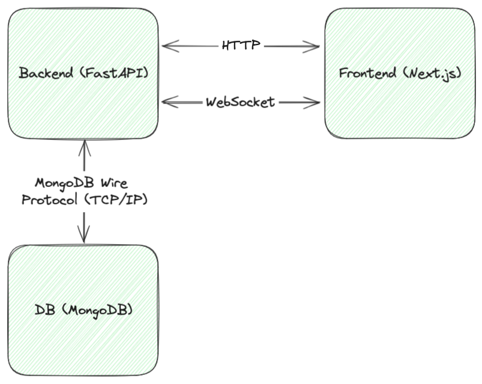
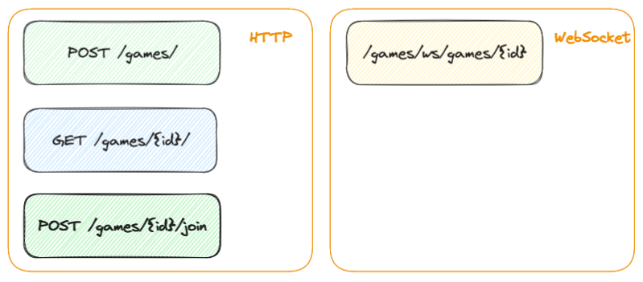

[](https://www.python.org)


[](https://github.com/astral-sh/ruff)
[](https://github.com/pre-commit/pre-commit)
[](https://opensource.org/licenses/MIT)

# Game
Connect 4

# Stack
- backend: Python 3.12, FastAPI, MongoDB, ruff
- frontend: Next.js, TypeScript, Tailwind CSS

# Diagrams



# Demo
[demo](data/connect4_demo.mov)


# Development
## Backend
### Prerequisites
```
cp .env.example .env
```

```
pre-commit install
pre-commit install --hook-type commit-msg
```

### Run linters
```
make lint
```

### To run
```
uvicorn src.main:app --reload
```
Open [http://localhost:8000](http://localhost:8000)

## Frontend
### Prerequisites
```
cp .env.example .env
```

### Run linters
```
npm run lint
```

### To run
```
npm run dev
```
Open [http://localhost:3000](http://localhost:3000)
